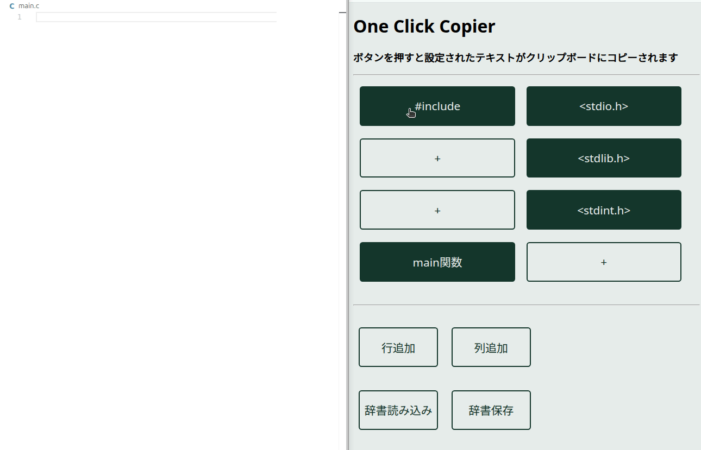

# One click copier

## 概要
- コピペのコピの部分を1クリックで済ませるツールです．
- スタンドアロン動作可能です．
  - サーバ等は不要です．
  - テキスト情報はインターネットに送信されません．

## 使用方法
### インストール
1.  お好きな方法でhtmlをダウンロードしてください．
    - [releases](https://github.com/KaiManabe/oneclick-copier/releases)より，最新のzipをダウンロード・展開
    - `git clone`
1. `index.html`をブラウザで開いてください．

### ボタンの追加と設定
1. ボタンを右クリックすると，**ラベル(ボタン名)**と**コピーしたいテキスト**を編集できます．
2. ボタンの外を左クリックすると編集モードを解除します．
3. `行追加`，`列追加`を押すとボタンを増やせます．

### ボタンの編集と削除
1. ボタンを右クリックすると，**ラベル(ボタン名)**と**コピーしたいテキスト**を編集できます．
2. ラベルおよびテキストを空白にして編集モードを解除すると，ボタンが削除されます．
3. 空(+マーク)のボタンが一行／一列並ぶと自動的に行／列が削除されます．

### ボタンのインポート／エクスポート
1. `辞書保存`を押すと，現在のボタン一覧がJSONファイルで保存できます．
2. `辞書読み込み`を押すと，JSONファイルで定義されたボタン一覧を呼び出すことができます．

## 免責事項
- MITライセンスに基づいて公開します．
- 改変や二次配布など，自由にしていただいて構いません
- 本スクリプトの使用に伴う不利益について，一切の責任を負いません．